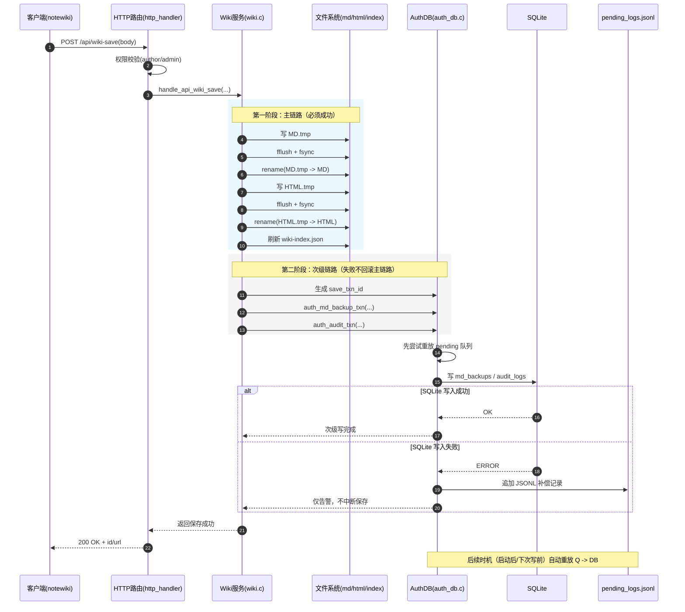

# Wiki 系统代码架构说明

本文档面向开发与维护人员，说明 Wiki 系统的代码结构、设计思路、关键原理与运维注意点，重点覆盖数据库同步、账号权限管理与文档存档策略。

---

## 1. 总体架构

Wiki 采用 **前后端一体化轻量架构**：

- 前端：`html/wiki/*.html` + `html/wiki/*.js`
- 后端：`src/*.c`（HTTP 路由、Wiki 业务、SQLite 认证与审计）
- 存储：
  - Markdown 主数据：`html/wiki/md_db/`
  - 发布 HTML：`html/wiki/`（按分类目录输出）
  - 上传文件：`html/wiki/uploads/`
  - SQLite：`html/wiki/sqlite_db/wiki_auth.db`
  - SQLite 补偿队列：`html/wiki/sqlite_db/pending_logs.jsonl`

系统遵循一个核心原则：**文件系统（MD/HTML）是主真相源，SQLite 是次级审计与历史系统**。

---

## 2. 代码分层与职责

### 2.1 前端层（交互与渲染）

- `notewiki.html`
  - 编辑、预览、保存、上传、导出入口
  - 登录态展示与写权限校验（未登录/无权限弹窗）
- `sidebar.js`
  - 目录树、PDF 导出辅助
- `rich-render.js`
  - Markdown 增强渲染与代码高亮
- `wiki-auth-admin.html`
  - 管理员页面（用户管理、日志查询、历史查询、文章贡献排行）

### 2.2 接口路由层

- `src/http_handler.c`
  - 路由分发（如 `/api/wiki-save`、`/api/wiki-users`）
  - 统一认证门禁（author/admin）
  - 请求体大小、错误响应、静态资源访问控制

### 2.3 业务层

- `src/wiki.c`
  - 文章保存/读取/删除/移动/重命名
  - 生成发布 HTML、刷新索引
  - 附件上传与引用清理
  - PDF/ZIP 导出

- `src/auth_db.c`
  - SQLite 初始化与 schema 管理
  - 登录会话、权限判定
  - 审计日志、MD 历史备份
  - 失败补偿队列与重放

---

## 3. 保存链路设计（关键）

当前实现按以下顺序执行一次保存：

1. 权限校验通过（author/admin）
2. 写 MD（临时文件 + `fflush/fsync` + `rename` 原子替换）
3. 写/更新发布 HTML（同样采用原子替换）
4. 刷新索引 `wiki-index.json`
5. 次级写 SQLite（历史与审计）
6. SQLite 失败写入本地补偿队列 `pending_logs.jsonl`
7. 后续自动重放补偿记录

这样可以保证：

- **核心文档可用性优先**：即使 SQLite 故障，MD 与 HTML 仍保存成功
- **崩溃一致性更好**：通过临时文件和重命名降低半写入风险
- **可追溯性保留**：失败日志进入补偿队列，后续可回灌

---

## 4. 原子写入原理与注意事项

后端在 `wiki.c` 中采用了统一写盘策略：

- 先写 `xxx.tmp`
- 写完后 `fflush + fsync`（Windows 使用 `_commit`，Linux 使用 `fsync`）
- 再 `rename` 到正式文件

注意点：

- 跨平台处理差异（Windows 先移除目标再 rename）
- 任一步失败要删除临时文件，避免残留污染
- 不应在原子写流程中穿插会阻塞太久的外部操作

---

## 5. 数据库同步与补偿机制

### 5.1 同步定位

SQLite 用于：

- 用户与会话管理
- 操作审计（audit_logs）
- MD 历史快照（md_backups）

不作为在线编辑的主数据源，不反向覆盖 MD 文件。

### 5.2 `save_txn_id` 链路追踪

每次保存会生成一个 `save_txn_id`（近似 UUID 风格），并贯穿：

- `md_backups.save_txn_id`
- 保存链路审计 detail（含 `save_txn_id`）
- 失败补偿 JSONL 记录

用于排查“某一次保存”是否完整落到审计与历史。

### 5.3 补偿队列

当 SQLite 写失败时，记录落入：

- `html/wiki/sqlite_db/pending_logs.jsonl`

记录类型：

- `audit`
- `md_backup`

系统在以下时机重放：

- 数据库初始化成功后
- 后续次级写入前

重放成功的记录会移除，失败记录保留，避免数据丢失。

---

## 6. 账户与权限管理设计

### 6.1 角色模型

- `admin`：全权限（含用户管理）
- `author`：文档读写、上传、发布、导出（不含用户管理）
- `guest`：只读浏览

### 6.2 登录态与会话

- 登录后发放会话 Cookie（`WIKI_SESS`）
- 后端解析 Cookie 并从 `sessions` 表恢复用户信息
- 会话有过期时间，支持登出清理

### 6.3 管理员配置

管理员账号来源于：

- `html/wiki/sqlite_db/db.config`

默认：

```ini
admin_username=Admin
admin_password=123456
```

服务启动会读取并确保该管理员账号存在且具有 admin 权限。

### 6.4 安全注意点

- 写接口强制后端权限校验（不能只信任前端）
- 分类与路径做安全过滤，防止路径穿越
- 上传文件名、扩展名白名单校验
- 审计记录中写入账号/IP/动作，便于追责

---

## 7. 文档存档设计（MD 历史）

### 7.1 存档目标

在不影响主保存成功率的前提下，记录可追踪、可查询的历史快照。

### 7.2 存档内容（`md_backups`）

- `article_id`
- `save_txn_id`
- `title`
- `category`
- `content`（Markdown 原文）
- `html`（保存时的发布内容）
- `editor`
- `ip`
- `created_at`

### 7.3 查询接口用途

- 最近 N 条修改记录
- 按文章 ID 查看历史链
- 用 `save_txn_id` 关联主保存动作和审计记录

---

## 8. 维护要点（高优先）

- 永远保持“文件主真相，数据库次级”的边界，不要让 SQLite 写失败阻断保存。
- 补偿队列文件要纳入运维巡检（大小、增长速率、积压时长）。
- 涉及保存流程改动时，必须回归以下场景：
  - 正常保存
  - SQLite 不可用保存
  - 进程异常中断后重启恢复
- 升级数据库 schema 时，优先使用可重复执行的 `ALTER` 策略并保持兼容。
- 管理员账号不要硬编码在前端，统一由服务端配置与校验。

---

## 9. 推荐后续增强

- 增加后台定时重放线程（固定周期重放 `pending_logs.jsonl`）。
- 为补偿队列增加最大长度与告警阈值，防止磁盘无限增长。
- 为 `save_txn_id` 增加跨接口检索 API，提升排障效率。
- 对关键链路增加集成测试：权限、保存顺序、失败补偿、重放一致性。

---

## 10. 附录：时序图风格保存流程

下面时序图对应“请求 -> 文件原子写 -> 索引刷新 -> SQLite 次级写 -> 补偿重放”的完整链路：



### 10.1 时序图解读

- **主链路**（MD/HTML/索引）是同步成功条件，任何失败都应直接返回错误。
- **次级链路**（SQLite 历史与审计）不影响主链路成功性，失败转入补偿队列。
- `save_txn_id` 贯穿历史、审计、补偿记录，用于端到端排障追踪。
- 补偿重放采取“成功删除、失败保留”策略，保证最终一致性与可恢复性。

